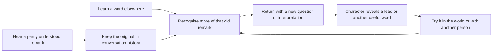

# Persistent language and conversation progression

Working plan for the day-2/3 rebuild, revised for Jørgen's 6 October instruction: learning must support the dialogue, with commands prepared for future stories and ordinary words returning in later conversations. **This is a plan, not a claim that all listed scenes are implemented.** Status distinguishes existing main, the current rebuild, and follow-up work.

## The persistent loop

The calendar stages initial encounters and determines where people are. Knowledge, remembered remarks, relationships and discovered topics determine progress. A topic must not expire because its introductory day ended. Learning in a different order should open the same connection when its last prerequisite becomes true.

The player does some of the connecting. The journal may show that words are newly recognisable, but it must not supply a full translation or announce the solution. Knowing one noun does not imply understanding an entire sentence. A misunderstanding can lead to a clarifying question; it must not silently count as correct knowledge.

### Starter connections

| Thread | Earlier incomplete meaning | Connection the player can make | Persistent payoff to author |
|---|---|---|---|
| Mori's Norway conversation | The player recognises the place name but not his wish to return | Learn ikitai in another exchange, reread また行きたい, then ask about going back | A new personal topic with Mori; its next reveal follows his established character outline. Later combine ikitai with isshoni in an invitation. The existing combined Aoi reply is one useful link, not the end of the thread |
| Repair evidence | A person asks for another test; the player initially relies on the visible gesture | Mouichido makes the repeat request intelligible; compare the ordinary result with the spoken-command result | A new follow-up about whether the original report explains what actually happened. Evidence, not a vocabulary count, opens the question; future repair scenes reuse the request |
| Reservations and social access | A desk conversation or note mentions a booking the player cannot yet identify | Yoyaku learned at a terminal makes that earlier fragment recognisable; ask whose booking it was | A reservation question with the relevant person, leading to a practical invitation or access conversation. Do not invent a conspiracy or give access merely for knowing the noun |

The Mori and Hamada reservation connections have durable remark records and shared question routing. Hamada’s booking remark plus yoyaku opens his ordinary invitation in either learning order; the repair-evidence connection remains an authored specification. Kenji’s recurring arcade conversation supplies an optional ikitai lesson if the player missed it earlier. Mori’s travel topic supplies the actual remark if the introductory dinner was missed; it does not award evidence merely for advancing the calendar. His photo request is recorded and the art-club physical stage is prepared; an approved photograph remains required before that meeting can run.

### RPG conversation contract

Every recurring cast member has an ordinary Talk entry: greetings, current activity, personal topics and a polite way out. Knowledge-based questions extend that menu. They do not replace ordinary conversation with a word-command console or make people mute until the correct flag is set.

Each authored topic needs: stable id; actor; heard remark/evidence ids; required understood words or phrases; relationship/story prerequisites if genuinely relevant; known/unknown response; new evidence or next topic; repeat response; and availability independent of the day script. Schedule controls whether the person can talk now, not whether the player has forgotten the topic. A busy character can defer a conversation; its unlocked question remains available on return. Avoid a global daily dialogue allowance and empty repeated nods.

A connection opens when its evidence and knowledge are both present, in either order. Important remarks need durable source records (speaker, original text, encounter, time/place), separate from a rolling chat backlog. Store facts the player heard separately from what they understood then and from their current interpretation. Save/Continue preserves all three. No automatically generated revelations: each new reply and consequence remains authored and checked against the character and world.

### Existing support and the gaps

- The backlog already stores raw spoken lines and re-renders overheard text with current vocabulary. This supports rediscovering meaning within retained entries.
- The rolling history survives day changes and records source context and vocabulary at the time, with a 400-entry cap. Authored important remarks have separate durable records, shown through Remembered remarks in the backlog. Re-reading uses current vocabulary while retaining the original speaker, text, source and understanding at the time. Legacy history leaves missing historical knowledge unknown.
- Shared optional conversation rows currently cover Kenji’s arcade topic, Mori’s travel/return question and Hamada’s evenings/booking question. They require meeting the speaker. The Norway follow-up requires both actually hearing Mori’s remark and knowing ikitai, in either order. It leads to an optional mitai reply and a recorded photo request. Ordinary Talk remains available. Morning office work defers these chats without consuming progress.
- Shared Chat also covers Mio, Emi, the guard, Kuro, Aoi and Rei. Kuro/Aoi/Rei require their actual story introductions, independently of an engine meeting flag. The ordinary topics and repeat replies persist across dates; working reception/B2 mornings can defer conversation without consuming it. These chats award no club attendance or relationship milestone.
- Five further heard-word links extend the persistent conversation graph: Mio’s quoted family advice plus yasumi, the guard’s short-rest offer plus yasumi, Kuro’s swimming remark plus oyogu, Aoi’s tennis wish plus ikitai, and Rei’s request for another game plus mouichido. Hearing and learning work in either order. Recognising one word opens a tentative question, not a translation of the whole remark. Kuro can supply a missed yasumi lesson; Emi and Rei can supply mouichido only when the player requests practice. Their replies immediately use the word, and the same words retain their later repair/activity uses.
- These recurring topic families give the named cast ordinary conversation coverage; they are not complete character arcs. The post-day-five calendar now preserves words, introductions, jobs and remembered remarks across Sleep, waiting and Continue, with a weekly cast schedule and recurring winter practice. The wider conversation graph, approved photo/art-club payoff and recorded karaoke performance remain outstanding; their prepared stages are gated until ready.

## Pacing decisions

- A scene first needs a human purpose. Add a lesson only where the player needs the word to participate or do something they care about.
- Usually introduce one new idea in a short encounter. Separate a second lesson with actual action or conversation; do not run a row of vocabulary prompts.
- The current day-2 core route has three new typed words: repeating a test, answering that it is okay, and taking food. Toasting and complimenting the meal are optional. A player who enjoys talking can learn more; there is no quota to clear before leaving.
- Day 3's two tickets introduce screen, booking and the print command across separate repair actions. The pool conversation has no compulsory vocabulary prompts. One optional swim/watch reply is enough; location and pace words can remain contextual.
- Day 4 primarily reuses what has been learned, with one optional social phrase. Day 5 combines familiar pieces in the delivery scene; it is not another batch of word introductions.
- Known words return as usable replies and recognisable speech, not forced retyping. Optional words never become unexplained prerequisites: provide an ordinary-language/physical alternative, or a short contextual catch-up at the point of need.
- Seeing a gloss is not learning a word. Preserve the game's explicit typed-attempt rule; contextual words are not silently added to the learned list.

## Commands: teach before the payoff

| Command | First meaningful use | Later payoff | Status / missing work |
|---|---|---|---|
| matte — wait | Day 1 train doors | Day 2 controlled door comparison; day 5 stopping the karaoke selector | Existing actions; day-2 comparison revised |
| ugoite — work/move | Day 1 copier | Day 2 release comparison; day 3 booking terminal; day 4 desk fan | Existing actions; keep physical repair alternatives |
| dashite — give it out | Day 3 booking printer, after the restart | Day 5 vending delivery, then add recipient/object wording around this familiar command | Existing chain; day-3 lesson revised. Deferred printer visit remains possible on day 4. Day-5 catch-up only if unknown |
| akete — open | Optional day-1 gate route | Future maintenance access: opening a stuck equipment cupboard after the owner asks for help | Follow-up design only; requires an actual hinged cupboard, manual alternative, and staged result before authoring a new lesson |
| irete — pour/make | Optional day-1 lunch | Future B2 tea preparation for a colleague, then a request specifying whose cup | Follow-up design only; do not claim it exists in the day-5 delivery scene |
| tomatte — stop | Optional day-1 lunch | Future maintenance inspection of a moving device, with a clear reason to stop it before inspection | Follow-up design only; needs a safe physical alternative and visible stop/restart before scheduling |
| kite — come | Defined but not scheduled for teaching | A future requested movement of an object toward the player | Deferred. No lesson until the target, motion and later reuse are designed and built |

The first five days therefore deepen three recurring commands rather than forcing all seven into the script. The remaining commands are explicit follow-up dependencies, not invented day-6 content or a promise of an implemented longer campaign. Day 5's ni/o/kudasai guidance introduces one compositional idea through one successful delivery, then lets the player stop or practise; it must not turn into three separate vocabulary tests.

## Conversation words: first encounter and later connections

Day references below identify the current scripts where a first encounter is staged. They are not progression deadlines or a required learning order. Move recurring topics into the persistent conversation layer as that layer is built.

| Word / pattern | Introduction | Planned later conversation use | Status |
|---|---|---|---|
| mouichido — once more | Day 2 repeat the ordinary station test | Day 3 ask for another monitor turn; day 4 ask Rei to retest the display | Day-2 introduction, day-3 monitor repeat and later winter-practice repeat reply are implemented; optional Emi/Rei catch-up and Rei’s persistent another-game question reuse it |
| daijoubu — okay | Day 2 report the door result; reply directly to guard/Kuro | Day 3 answer the guard's sign-off question; day 4 respond after a serve or check on Aoi | Day-2 introduction and later winter-practice reply implemented; other persistent replies remain to add |
| tabetai / nomitai — want to eat/drink | Day 2 meal; optional tea conversation | Day 4 choose a drink after tennis; day 5 answer Kenji's ordinary-drinks question | Day-2 introduction implemented; later replies to add |
| ikitai + isshoni — want to go + together | Optional day-2 Mori conversation or Kenji’s recurring arcade topic; optional day-4 invitation | Combine the two in Aoi's day-4 invitation | Existing guarded combined reply in day4/tennis.js; ordinary activity choices work without either |
| mitai — want to see | Optional day-2 telescope or Mori’s recurring photo conversation | Day 4 choose to watch Rei's serve; day 5 ask to see another delivery | Introduction exists; later replies to add. Distinguish it from miru rather than immediately teaching another near-duplicate |
| yasumi — break/day off | Optional day-2 Kuro work conversation | Day 5 Kuro asks about the weekend, allowing a reply about the club visit | Day-2 introduction and optional recurring Kuro catch-up implemented; recognises Mio’s family advice and the guard’s short-rest offer |
| kanpai / oishii — cheers/delicious | Optional day-2 toast / compliment | Day 5 ordinary team drinks; later canteen meal conversation | Day-2 introduction implemented; day-5 toast planned. Canteen reuse needs an authored social meal, not a wordless empty room |
| gamen — screen | Day 3 monitor repair | Day 4 score display and day 5 karaoke screen | Day-3 introduction and scoped day-4/5 references implemented |
| yoyaku — booking | Day 3 booking-terminal repair | Day 4 Rei's court reservation | Day-3 introduction, day-4 reservation reference and Hamada’s persistent booking/invitation connection implemented |
| koko — here | Optional day-3 map interaction | Point at the map on days 4 and 5 | Existing inherited interaction; later spoken direction remains a separate follow-up |
| oyogu — swim | One optional reply in the pool scene | Recognise Kuro’s later question about swimming; use it in later club conversations | One optional lesson implemented, with Kuro’s later swimming question. Further club conversation use is planned; watching reuses known mitai |
| puru / yukkuri / miru — pool / slowly / watch | Contextual pool speech only | Recognise location or pace while the scene continues | No forced lessons or learned flags just for hearing them |

## Acceptance before landing a story change

Record each new word's introduction, an immediate response/action, and a specific later node or an explicitly unbuilt dependency. Review one ordinary route and one talkative route: count interruptions and check that a scene still works when every optional lesson is declined. Check both known and unknown branches, missed previous days, and Continue. For commands, verify the visible effect against the spoken action; for ordinary words, verify the character's reply makes sense without assuming knowledge the player never acquired. Voice coverage alone does not prove either.
