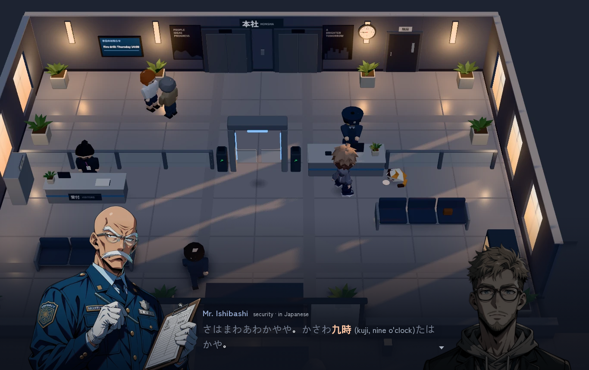
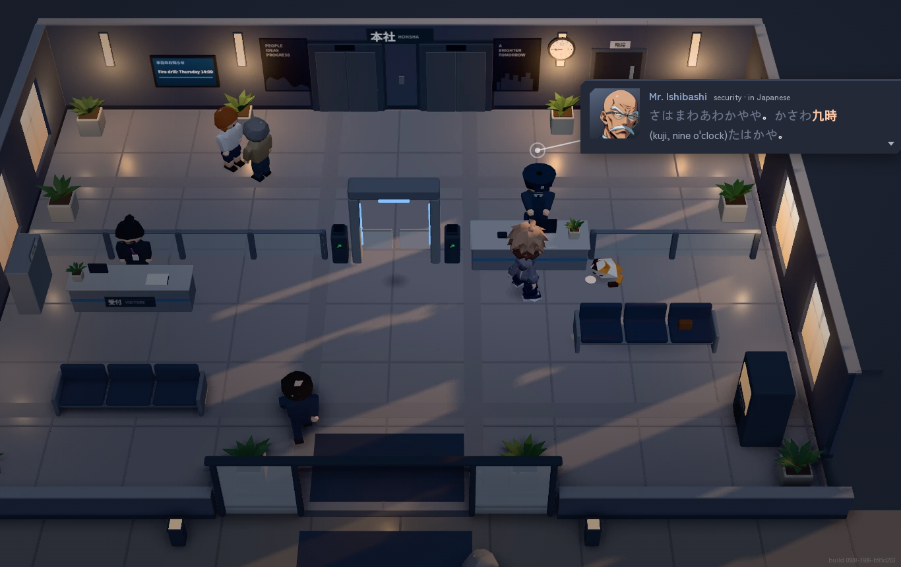
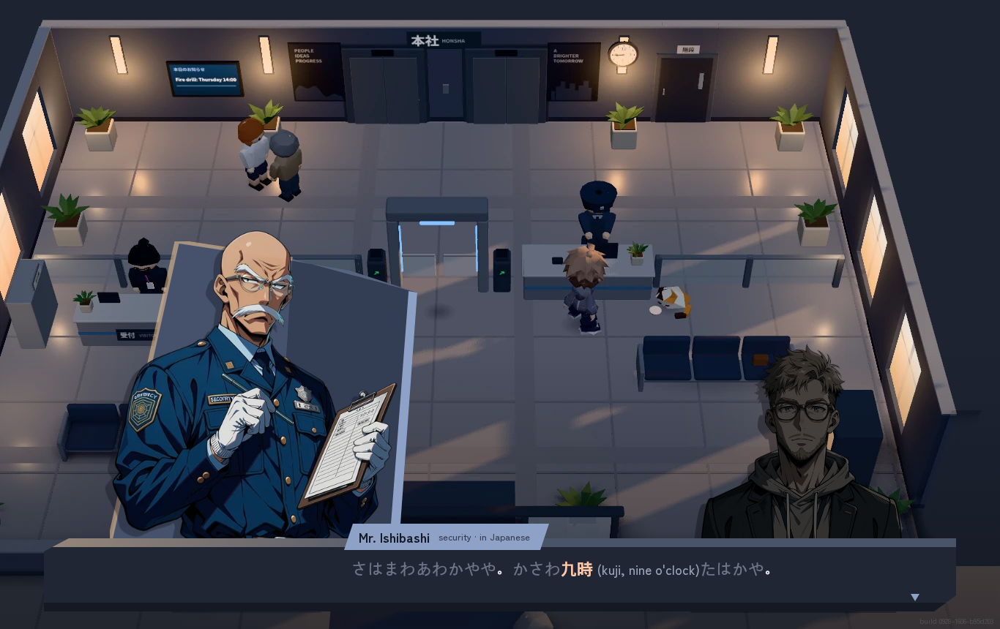

# Dialogue overlay: research and three directions

Jørgen (2026-09-28): the portrait and text box overlay "doesn't blend elegantly or well with the game, how do top tier games do this?" He also wants portraits that change with emotion during a conversation.

This is a proposal. Nothing in the game has changed. The mockups are static pages over a real lobby screenshot, using the real portrait cut-outs from `game3d/assets/portraits/`.

## What's wrong with the current overlay

See `current-desktop.png` and `current-phone.png`.

- The text box is the same dark rounded rectangle with a 1 px hairline as the HUD pills. It reads as a web app panel dropped on the game.
- The portrait floats. Its bottom edge ends in mid-air just under the box, with a drop shadow onto the floor tiles of a room it isn't in.
- The portrait carries its own lighting (full saturation, flat studio light) while the room is dim navy with warm window light. Nothing connects the two.
- Box and portrait are separate shapes with no relation: portrait on the left, box in the middle, a gap between.
- On a phone the portrait hangs in the middle of the screen over the world.

## How other games do it

Screenshots are not copied into the repo. Links go to pages that show them. Where a detail is from memory rather than a source, it says so.

**Persona 5 / Royal.** The speaker's bust stands on one side and overlaps a jagged black speech-bubble box with a white outline; the name sits on a tilted tab. The box uses the same cut angles and red, black and white as every menu, so it belongs to one system. Portraits snap in fast and swap expression per line. Steal: the box shape comes from the game's own visual language, and the portrait overlaps the box instead of sitting next to it. ([gameuidatabase](https://www.gameuidatabase.com/gameData.php?id=72), [UI breakdown](https://ridwankhan.com/the-ui-and-ux-of-persona-5-183180eb7cce))

**Persona 3 Reload.** Same structure in a blue, watery palette. The UI team said many elements are drawn at runtime with colour applied in code rather than baked into textures. Steal: build the overlay so its colours can shift per place and time of day. ([interview](https://personacentral.com/p3r-interview-menu-ui/), [gameuidatabase](https://www.gameuidatabase.com/gameData.php?id=1884))

**Fire Emblem: Three Houses and Engage.** Most conversations use the 3D models framed waist-up with facial animation, over a softened version of the location, and a plain bar at the bottom with a name tab (from memory; the sprite sheets online are menu portraits). The speaker animates while the listener holds still. Steal: soften the world behind a conversation rather than covering it. ([gameuidatabase, series](https://www.gameuidatabase.com/index.php?set=1&sort=2&series=20&tag=132))

**Octopath Traveler I and II, Triangle Strategy (HD-2D).** Octopath has no dialogue portraits at all: a dark box with a thin frame and the pixel sprites acting in the diorama. Big story beats get heavier framing and vignettes, small talk stays light. Triangle Strategy keeps routine field talk small and close to the characters and saves portraits for story scenes (players noticed the missing portraits). Steal: small talk belongs to the character in the world; escalate the frame only for important moments. ([Octopath II UI notes, Japanese](https://note.com/nekono_miru/n/n7bb394ff7438), [Triangle Strategy on gameuidatabase](https://www.gameuidatabase.com/gameData.php?id=1539))

**Genshin Impact, Honkai: Star Rail.** No 2D portraits in field dialogue. The camera frames the 3D character, and the line sits centred on a soft dark gradient that rises from the bottom of the screen, with the name in a gold or accent colour above it. There is no box. Choices appear as a short list on the right. Steal: the gradient band. It lets the world stay the backdrop and never draws a rectangle on it. ([Genshin on gameuidatabase](https://www.gameuidatabase.com/gameData.php?id=470), [Star Rail on interfaceingame](https://interfaceingame.com/games/honkai-star-rail/))

**Hades.** Large painted portraits beside a simple dark box, each character with many expression variants and a colour identity. Portraits move a little (breathing, small poses), and lines react to what just happened in the run. Steal: many expressions per character and a little motion; the writing carries the life, the box stays plain. ([GDC talk](https://www.gdcvault.com/play/1026975/Breathing-Life-into-Greek-Myth), [write-up](https://www.gamedeveloper.com/audio/dive-into-the-dialogue-of-i-hades-i-at-gdc-2021))

**Disco Elysium.** No bottom box. A tall column on the right where lines pile up and scroll like a chat log, with the speaker's portrait at the top. The designers put it bottom-right because that's where people look on a computer screen. Steal: a scrollback log for re-reading lines, not the layout. ([80.lv](https://80.lv/articles/disco-elysium-working-on-ui-design), [article](https://gamermatters.com/disco-elysiums-text-box-design-is-inspired-by-how-we-use-computers-and-twitter/))

**Yakuza / Like a Dragon.** Field conversations are 3D characters with subtitles on an optional translucent bar; illustrated cut-ins only for combat moves (details partly from memory). Steal: when the world models act the scene, the portrait can be optional. ([menus FAQ](https://gamefaqs.gamespot.com/ps5/409974-like-a-dragon-infinite-wealth/faqs/81106/menus))

**Sea of Stars.** Speech bubbles with a tail sit over the speaking sprite in the world, styled like the rest of its pixel UI (from memory, please check the footage). Steal: a bubble pinned to the speaker keeps the eye in the world. ([gameuidatabase](https://www.gameuidatabase.com/gameData.php?id=2196))

**Stardew Valley.** The box has a portrait panel on the right with the name under it. Each villager has a small grid of expressions picked by codes in the script (`$h` happy, `$s` sad, `$u` unique, `$l` love, `$a` angry). The box uses the same wood panel as every menu. Steal: expression codes written into the script lines, and one material shared by all the UI. ([wiki: dialogue modding](https://stardewvalleywiki.com/Modding:Dialogue))

**Unicorn Overlord.** Vanillaware's painted portraits have skeletal idle animation (breathing, blinking, small shifts) on a single painting, set in ornate frames that match the painted world (studio house style; I couldn't find a structural breakdown). Steal: a subtle idle on one image goes a long way. ([design works book](https://www.thevideogamelibrary.org/book/unicorn-overlord-official-design-works))

### What the good ones share

1. The overlay is built from the same visual kit as the rest of the game, not a generic panel.
2. The portrait is anchored: it overlaps or stands behind the box, or rises from the screen edge. It never floats.
3. The world stays visible and gets softened (dimmed, blurred, vignetted) rather than covered.
4. The listener is dimmed, or not shown.
5. Emotion is carried by many small expression swaps plus a little motion, and the frame gets heavier only for big beats.

## Three directions

All three use the same short exchange at the security desk: the guard (stern) tells Eric his card isn't registered until nine, Eric (surprised) answers, the guard (amused) softens. The `-sequence.png` strip for each direction shows those three lines in a row. Open a page with `?s=1`, `?s=2` or `?s=3` to see each line; without `?still` the motion plays.

### 1. Stage light (`mock-1.html`)

- Look: no box. A navy gradient rises from the bottom of the screen and the edges get a light vignette, like a camera stopping down. The line sits in that band with a soft text shadow, the name in the speaker's colour above it. Portraits stand on the bottom edge of the screen and are cut by it. Each portrait gets the room's light laid over it: a faint warm tint at the top and navy shading toward the bottom, so the lower body sinks into the band. The listener steps back, darker and slightly smaller.
- Motion: the line rises 26 px and fades in (0.22 s). The speaker breathes (a 0.6% vertical scale over about 4 s). A swap of speaker crossfades the brightness between the two portraits.
- Emotion: the portrait image swaps with a short crossfade. Each kind of emotion gets one motion: a 14 px hop for surprise, a slight lean in for stern, a slow bob for amused. Blink comes later from an eyes-closed frame per portrait.
- Phone: the band takes the lower 45% of the screen. Only the speaker shows, rising out of the band at 400 px tall; the listener is dropped. The line runs full width at 20 px.
- Grade per place: the tint on the portrait comes from the place (warm window light in the lobby, cool fluorescent in the basement, orange at sunset on the train), so the same image fits every room.

### 2. Pinned card (`mock-2.html`)

- Look: the line sits on a small card hung beside the speaker in the world, joined to a dot and ring over their head by a thin stem. That stem and dot are the same pin language as the world markers already in the game. The card is a solid slate with a lighter top edge and cut corners, like the flat-shaded props. The portrait appears only as a face crop in the card's corner, on a tile of the speaker's colour.
- Motion: the card drops in 8 px. The face pops (scale 0.86, 1.06, 1) on every new expression. In a build the card and stem follow the projected head position each frame.
- Emotion: the face crop is where the expressions show, and since our expressions differ only in the face, a crop shows them at full size. Surprise adds a short shake. The chibi in the world can play its emote bubble at the same moment.
- Phone: the card runs full width and sits just below the speaker, with the stem going straight up to the head.
- Big scenes switch to the full portraits of direction 1; small talk and overheard chatter stay on the card.

### 3. Flat-shaded slab (`mock-3.html`)

- Look: the text box is a solid slab drawn like the world's props: a lit top face, a front face and a dark lip, with one corner cut, in the lobby's own wall colours. The top face catches the warm window light (#f3c48f, sampled from the lobby windows) at the left. The speaker stands behind the slab, cut at the waist by it, in front of a tall faceted prism in the same slate as the floor and walls, with the window light along its left edge and a thin stripe of the speaker's colour on its dark side. The name sits on an angled tab in the speaker's colour. The listener stands dark behind the slab on the right.
- Motion: prism and portrait slide in 30 px from the left. On a new expression the portrait snaps (scale 1.03 and back); surprise adds a 4 px shake.
- Emotion: expression swap plus a flat diamond mark on the corner of the prism (! for surprise), used only for strong beats.
- Phone: the slab runs full width across the bottom 132 px, the speaker and prism above it on the left, no listener.

## Critic scores

A fresh critic agent compared the three mockups against the current overlay, looking only at the rendered images. Scores out of 10.

| | Blends with the world | Reading | Portrait | Phone | Expression change | Overall |
|---|---|---|---|---|---|---|
| Current | 4 | 7 | 5 | 5 | 4 | 5 |
| 1 Stage light | 7 | 5 | 8 | 5 | 8 | 6.5 |
| 2 Pinned card | 8 | 6 | 3 | 4 | 3 | 5 |
| 3 Flat-shaded slab | 6 | 8 | 9 | 8 | 9 | 7.5 |

Its main points:

- Current: the box looks like a web app notification over a game, and Mio floats with no ground under her.
- 1: the most in-world of the three and the lit and dimmed pair reads at once, but the line has no backing, so grey text sits on grey floor tiles. On a phone the portrait covers the middle of the scene, including the guard's own chibi.
- 2: the stem to the guard's head is clever and hides the least of the world, but a 76 px face is too small for stern and amused to read apart, and the card jumps around the screen between speakers, so the eye has to hunt for every line.
- 3: big portraits, a stable place to read, the clearest expression changes and the cleanest phone layout. Its weak spot was blend: the prism was a flat periwinkle for the guard and tan for Eric (tan is close to the rejected brown and gold), brighter than anything in the lobby, and the slab was too tall for one line.
- It would ship direction 3 with direction 1's dimming, and its one change was to pull the prism into the scene's light: floor slate with the window's warm light on one edge, and a slab about 40% shorter.

After the review, direction 3 got that change: the prism is now slate facets with a warm lit edge and a thin stripe of the speaker's colour, Eric's colour is a cool grey-teal, and the slab is 100 px tall instead of 132 on desktop (168 to 132 on a phone). The PNGs in this folder show the revised version; the critic scored the earlier one.

## Recommendation

Direction 3, the flat-shaded slab, with two things taken from the others:

- From 1: the listener dims and shrinks, and each place tints the portraits (warm at the top, the place's shadow colour at the bottom) so the painting takes the room's light.
- From 2: overheard chatter and one-line barks from people in the world use the pinned card, so the slab only comes up for real conversations.

Why: the slab is drawn the way the world is built (a few flat faces lit by the same window), so it reads as part of the game rather than a panel on top. It keeps the portraits big, which is what makes expression changes land. And it gives the line one fixed place, which matters in a game where some of the text is Japanese.
## Expressions: what we need to make

- Six faces per main character: neutral, smile, serious, surprised, flustered, tired or sad. The guard, Kenji, Kuroda, Mori and Eric have three each; Mio, Aoi and Kuro only have neutral.
- Keep the body and pose identical across faces and change only the head, as the current sets do. Then the swap reads as the face moving, and a crossfade can't ghost.
- Blink: one eyes-closed frame per face, made by inpainting only the eye area of the approved image (training-free, in line with the GUIDE). Show it for about 120 ms every 3 to 6 s.
- Script: the `face` field on `say` already exists. Motion follows from the face (surprised hops, flustered shakes), so writers only pick the face.

## Files

- `DIALOGUE-OVERLAY.md` (this file), `mock-1.html`, `mock-2.html`, `mock-3.html`, `mock.js` (the shared lines)
- `mock-N-desktop.png` (1366x860), `mock-N-phone.png` (390x844), `mock-N-sequence.png` (three lines in a row)
- `bg-lobby-1366.webp`, `bg-lobby-390.webp`: game screenshots without UI (capture mode, `place=gate`)
- `current-desktop.png`, `current-phone.png`: the overlay as it is now
